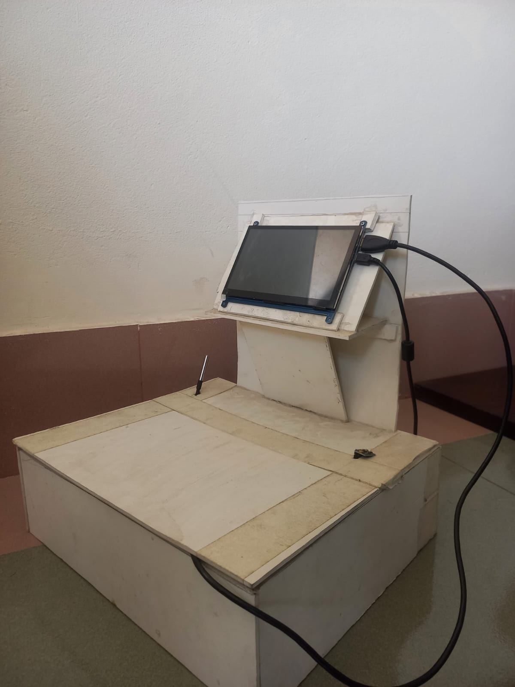
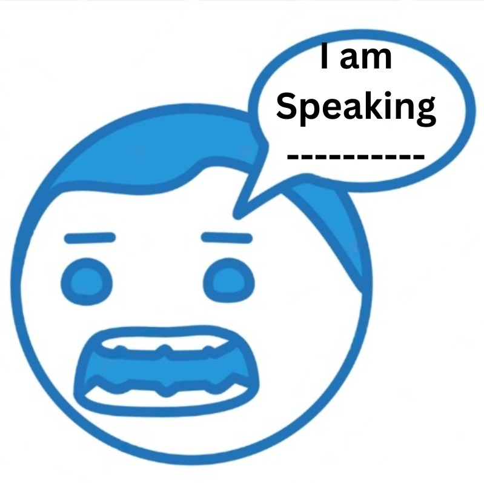
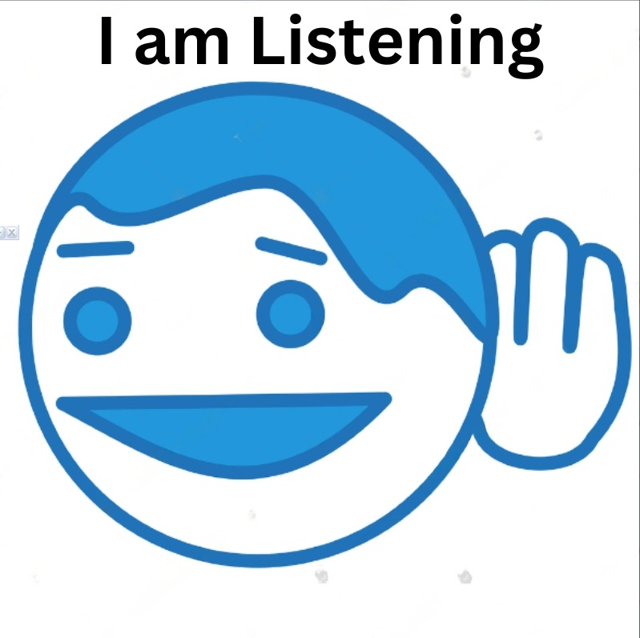

# Diabetes Patient Pre-screening Chatbot

This project, titled **"An AI-NLP based Interactive Chatbot Model for Patient Prescreening at Doctor’s Consultancy,"** was presented at the 2022 International Conference on Innovations in Science, Engineering and Technology (ICISET). The chatbot is developed to assist in the pre-screening of diabetes patients, combining AI-driven NLP and sensor modules for efficient data collection. This interactive chatbot can help streamline doctor-patient consultations by gathering and analyzing health data in advance, aiming to reduce wait times and improve patient experiences.

## 🌐 Overview

Diabetes is a prevalent health issue, especially in Bangladesh, putting strain on healthcare resources. This project introduces a comprehensive solution integrating a chatbot and sensors to aid in diabetes patient pre-screening. The chatbot interacts with patients to gather essential data like lifestyle, symptoms, and medical history, while sensors measure vital signs such as body temperature, heart rate, and oxygen levels. The collected data is displayed in a user-friendly format for healthcare providers, facilitating quicker and more informed consultations.

<p align="center">
  
  
  
</p>

## 🛠️ Features

- **Conversational Chatbot**: Uses NLP to gather patient information like symptoms, family history, and medical history.
- **Sensor Integration**: Measures vital health data such as temperature, heart rate, and oxygen levels.
- **Real-time Data Display**: Presents collected data on a display screen for easy reference by healthcare professionals.
- **High Accuracy**: Achieves over 90% accuracy in intent recognition and information extraction.

## 🚀 Technology Stack

- **Python**: Core language for chatbot and data processing.
- **Natural Language Toolkit (NLTK)**: NLP framework for chatbot conversations.
- **Artificial Neural Network (ANN)**: For intent prediction within conversations.
- **Raspberry Pi**: Hardware used for integrating sensors.
- **Sensors**:
  - **DS18B20**: Measures body temperature.
  - **MAX30100**: Pulse oximeter sensor for heart rate and oxygen saturation.
  
## 📋 Requirements

- Python 3.7+
- NLTK
- Flask (optional, for web-based deployment)
- Raspberry Pi with necessary sensor modules (DS18B20, MAX30100)

## 📂 Project Structure

- **`chatbot.py`**: Main chatbot logic and conversation handling.
- **`sensor_integration.py`**: Code for interfacing with sensors and capturing health data.
- **`templates/`**: HTML files (if deploying on the web with Flask).
- **`README.md`**: Documentation of the project.
- **`requirements.txt`**: List of Python dependencies required for the project.

---

## 🛠️ Usage

### Clone this repository:

```bash
git clone https://github.com/Md-Rifat-Islam/Diabetes_Patient_Pre-screening_Chatbot.git
cd Diabetes_Patient_Pre-screening_Chatbot
```

### Install required packages:

```bash
pip install -r requirements.txt
```

### Connect and set up sensors on the Raspberry Pi.

### Run the chatbot:

```bash
python chatbot.py
```

---

## 📈 Evaluation and Results

The chatbot and sensor integration were evaluated based on:

- **Machine Learning Model Accuracy**: The ANN model achieved over 90% accuracy in intent recognition.
- **Sensor Accuracy**: Compared against medical-grade devices, sensor readings showed minimal fluctuation, demonstrating reliable performance for pre-screening purposes.

---

## 🔬 Experimental Setup

The prototype system consists of:

- A Raspberry Pi for data processing and integration.
- A display showing patient health data for doctor review.
- Sensor modules housed in a compact, patient-friendly box.

---

## 📧 Contact

For questions or feedback, reach out via [LinkedIn](https://www.linkedin.com/in/muhammad-rifat-islam-9ab376230/) or email at rifat010bushra@gmail.com.

---

*Thank you for exploring the Diabetes Patient Pre-screening Chatbot project!*

